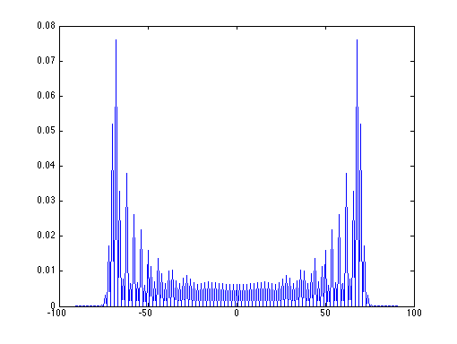
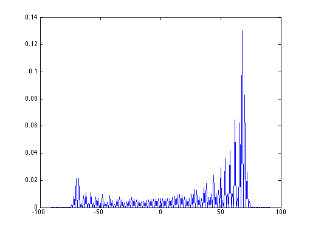

DQWL
====

Simulation of Discrete Quantum Walk on a Line using the Matlab.

### Usage

1. Puts all `*.m` files in a directory.
2. Sets the directory as the working directory of the Matlab.
3. Calls the function `dqwl(n)` with an argument `n`, which is the number of steps to be walked by the quantum walker. The function will returns a `(2 * n + 1)`-dimensional vector, whose `i`-th coordinate representing the probability of the quantum walker at the coordinate `(i - (n + 1))` after `n` steps.
4. Calls the function `dqwl(n,s)` with an argument `n` and an optional argument `s`, will simulate the discrete quantum walk on a line in `n` steps and the initial coin state is set to `s`.

### Example Usage

```
plot([-100:100], dqwl(100))
```

The above command will yield the following diagram:




```
plot([-100:100], dqwl(100, qubit(1)))
```

The above command will yield the following diagram:

